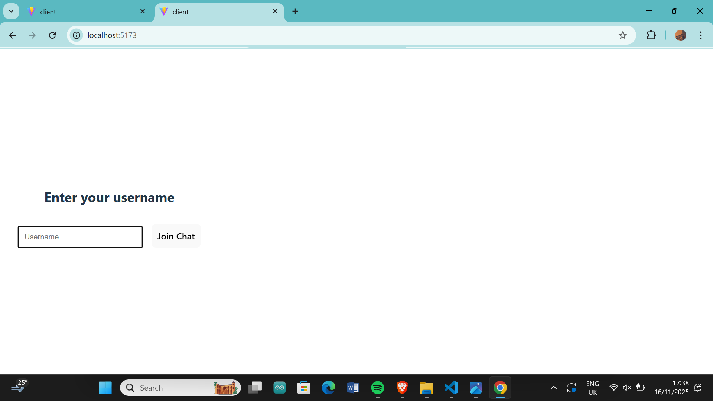
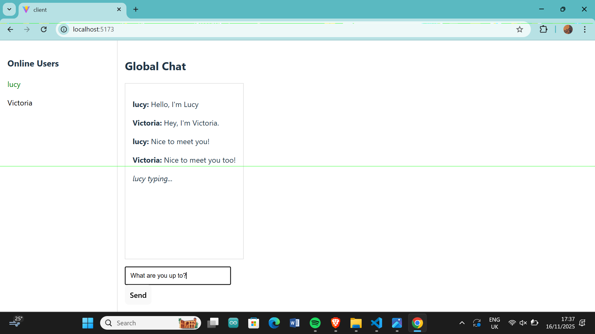
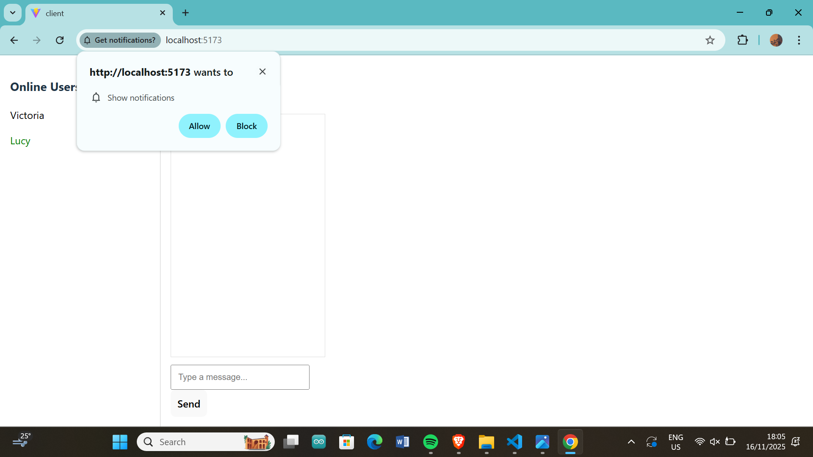
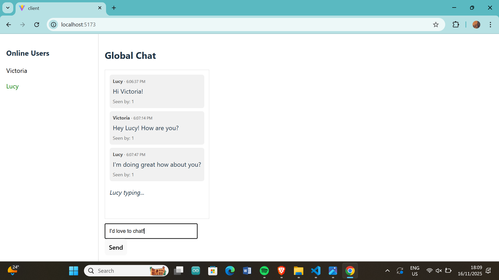

# Real-Time Chat Application with Socket.io

This assignment focuses on building a real-time chat application using Socket.io, implementing bidirectional communication between clients and server.


---

## Implemented Features
- Real-time global chat (Socket.io)
- Private messaging
- Typing indicator (shows who is typing)
- Online users list (updated on join/leave)
- Delivery acknowledgement (ACK) — server records who received each message and notifies the sender (`message_delivered` events)
- Read receipts — users can click a message to mark it as read; server records read receipts and notifies the sender (`message_read` events)
- Browser notifications when the page is hidden (requests permission)
- Simple in-memory message store and API endpoints (`/api/messages` and `/api/users`) for demonstration and pagination

---

## How to run (local)

### Requirements
- Node.js 18+ (or current LTS)
- npm
- Ports: default backend `5000`, frontend `5173`

### 1. Install server dependencies
```bash
cd server
npm install
```

### 2. Install client dependencies
```bash
cd client
npm install
```

### 3. Start the server
```bash
cd server
node server.js
```

### 4. Start the client
```bash
cd server
npm run dev
```

## Testing
Open two browser windows (or two different devices) to test:
Enter two different usernames
Send messages in global chat
Click messages to mark as read
Observe delivered/read counts on each message
Try private messaging by clicking a user in the sidebar

### Notes for the reviewer / instructor
This project demonstrates core Socket.io bidirectional features required by Week 5.
Extra features: delivery ACKs, read receipts, sound & browser notifications were implemented to demonstrate real-world chat behavior.
For evaluation, the backend currently uses in-memory storage for messages — this was chosen to keep the demo simple. Moving to MongoDB is straightforward (store message objects and update delivered/read arrays).

## Project Structure

```
socketio-chat/
├── client/                 # React front-end
│   ├── public/             # Static files
│   ├── src/                # React source code
│   │   ├── assets/    
│   │   ├── components/     # UI components
│   │   ├── socket/         # Socket.io client setup
│   │   └── App.jsx         # Main application component
│   │   └── App.css   
│   │   └── App.jsx         # Main application component
│   │   └── index.css
│   │   └── main.jsx      
│   └── index.html
│   └── package-lock.json     
│   └── package.json        # Client dependencies
│   └── README.md           # Client README.md
│   └── vite.config.js
├── server/                 # Node.js back-end
│   ├── node_modules/   
│   ├── server.js           # Main server file
│   └── package-lock.json   
│   └── package.json        # Client dependencies
└── README.md               # Project documentation
```

## Screenshots of working application



